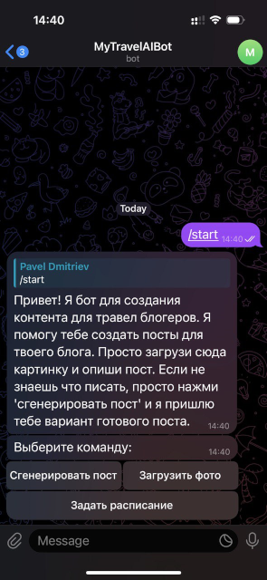

# Коммерческое предложение на разработку SMM-эксперта в формате Telegram-бота для создания контента о путешествиях

### **1\. Описание проекта**

#### **1.1. Цель проекта**

Разработка Telegram-бота, способного автоматически генерировать качественный контент о путешествиях – текстовые посты и изображения – и публиковать его в Telegram-группе. Бот будет помогать администраторам групп улучшить регулярность и привлекательность публикаций, а также анализировать вовлечённость аудитории.

#### **1.2. Используемые технологии**

* **Язык разработки:** Python  
* **Интеграция с Telegram:** python-telegram-bot, Telegram Bot API  
* **Генерация контента:** OpenAI API (ChatGPT для текстов и DALL-E или Yandex.Art для изображений)  
* **Публикация и автоматизация:** Make  
* **База данных:** SQLite (для хранения данных о публикациях и аналитики)

#### **1.3. Среда для развёртывания**

* Облачный сервер (Heroku, DigitalOcean, AWS или аналогичный)  
* Локальное/облачное размещение базы данных

### 

### **2\. Основные функции бота**

#### **2.1. Функциональные возможности для пользователей**

* **Генерация контента:**  
  * Создание текстовых постов на темы путешествий (советы, маршруты, описание интересных мест)  
  * Формирование привлекательных описаний для каждого поста  
  * Автоматическая генерация изображений, соответствующих тематике публикации  
  * Возможность добавить свои изображения и сгенерировать к ним текст с заданной тематикой  
* **Автоматизация публикаций:**  
  * Планирование и настройка времени публикаций в Telegram-группе  
  * Возможность регулярного обновления контента по заданному расписанию  
* **Анализ вовлечённости:**  
  * Сбор статистики просмотров, комментариев и другой обратной связи для дальнейшей оптимизации контента

#### **2.2. Административные функции**

* **Управление группами:** Авторизация и управление Telegram-группами, где бот является администратором  
* **Настройка публикаций:** Интерфейс для выбора времени и частоты публикаций  
* **Отчётность:** Модуль для отображения аналитики по вовлечённости аудитории

#### **2.3. Ключевые технические детали**

**2.2.1. Архитектура** 

* Основной бот (обработчики команд, сообщений и публикации постов в группу).   
* Модуль для работы с базой данных (SQLite).  
* Модуль планировщика (Apscheduler).   
* Модуль автоматической публикации контента (публикация в группу).  
* Модуль аналитики.

### **3\. Реализация проекта**

#### **3.1. Этапы разработки**

* **Анализ требований и подготовка ТЗ:**  
  * Проведение интервью с заказчиком, сбор подробных требований, формирование технического задания.  
  * Согласование ТЗ с заказчиком, внесение необходимых правок и утверждение финальной версии документа.  
* **Разработка функционала бота:**  
  * Интеграция с OpenAI API для генерации текстов и изображений.  
  * Настройка Telegram API для получения и отправки сообщений.  
  * Разработка модулей планировщика и автоматической публикаций постов.  
  * Разработка модуля аналитики.  
* **Тестирование и отладка:**  
  * Проведение тестирования на рабочем сценарии (тестовая группа).  
  * Оптимизация кода и устранение ошибок, а также обработка ситуаций недоступности внешних API.

#### **3.2. Техническая архитектура**

* **Основной модуль бота:** Обработка команд и сообщений.  
* **Модуль работы с базой данных:** Хранение информации о публикациях, настройках и аналитике.  
* **Модуль планировщика:** Задание и изменение расписания публикаций через бот.  
* **Модуль публикации**:  Организация автоматической публикации по расписанию.  
* **Модуль аналитики**: Вывод статистических данных по аудитории

### **4\. Внедрение и передача бота заказчику**

#### **4.1. Внедрение**

* Развёртывание бота на выбранном сервере.  
* Проведение тестирования в рабочей среде с реальными сценариями использования.  
* Инструктаж и обучение администратора для управления ботом.

#### **4.2. Поддержка**

* Обеспечение технической поддержки и оперативного обновления функционала по мере необходимости (в рамках дополнительного соглашения).

### 

### **5\. Сроки, стоимость и условия проекта**

#### **5.1. Сроки**

Предварительный срок выполнения работ – **14 календарных дней** (окончательные сроки будут согласованы после составления детального технического задания).

#### **5.2. Стоимость**

Предварительная стоимость разработки – **YY 000 российских рублей**.  
Окончательная оценка будет произведена по результатам детального ТЗ и обсуждения всех функциональных деталей.

#### **5.3. Условия сотрудничества**

* Возможна работа по договору с самозанятым.  
* Гарантии по качеству разработки и оперативное устранение выявленных ошибок.

### 

### **6\. Аналогичный кейс**

#### **6.1. Пример реализации**

Как пример успешной автоматизации публикаций, ранее мной был реализован Telegram-бот для управления публикаций в телеграм-группе на тему путешествий, который включал:

* Генерацию постов и изображений к ним с помощью ИИ.  
* Административную панель для управления расписанием.  
* Надёжную интеграцию с Telegram API и использование планировщика для регулярной публикации постов.

Этот опыт позволяет мне уверенно браться за разработку SMM-эксперта для создания контента о путешествиях и автоматизации публикаций в Telegram.

#### **6.1. Пример работы панели администратора при автоматической генерации контента**

 

 

#### **6.2. Пример работы панели администратора при добавлении своего изображения с генерацией текста**

	

 

#### **6.3. Пример работы панели администратора при задании и удалении расписания публикации авто сгенерированных постов**

 	

  
